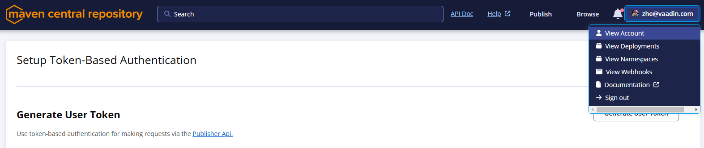

- vaadin-parent changes
- bender maven setting changes
- vaadin-parent test release build

- currently, we own three namespaces under vaadin organization:
  - `dev.hilla`: used for deploying the hilla project, it is not in use at the moment, so i have taken it for testing the maven central portal;
  - `com.vaadin`: this is used by us, both platform and framework, together with vaadin owned addons
  - `org.vaadin`: we are not using this namespace at the moment, but _flowingcode_, our Framework subcontractor, is use this for FW addons


_*We have migrated `dev.hilla` only_

_*We need to contact maven support(central-support@sonatype.com) for this migration_

### requirements:
- maven central account with access to vaadin namespaces
  - Generate User Token

### Changes in vaadin-parent
In _pom.xml_, replaced `org.sonatype.plugins:nexus-staging-maven-plugi` with `org.sonatype.central:central-publishing-maven-plugin:0.7.0`.
When we set `autoPublish=false` (by default, this option is set to false), we can deploy a staging bundle for testing.
When using the `central-publishing-maven-plugin`, we can set `autoPublish=true` to skip the staging phase, which will publish the artifacts to maven central directly.


### Changes in maven-settings

in _maven-settings.xml_, add the following blocks
```
<settings>
    <!-- maven central publish -->
    <server>
        <id>central</id>
        <username><your-token-username></username>
        <password><your-token-password></password>
    </server>
</settings>
```
you can access bender.vaadin.com and check the `bender-settings-maven-central-portal.xml` file

### use the artifacts before publishing
After you have deployed the bundle, you can access them via [this link](https://central.sonatype.com/publishing/deployments), where you can manually download and publish the artifacts.* 

_*at the moment, the right to access the deployed bundle is limited_

for using the staged artifacts in project, you will need to do the [following modifications](https://central.sonatype.org/publish/publish-portal-api/#maven) in your `settings.xml` file
reminder: the token used in the docs is an example one, you should replace it with your own after Base64 encoding. 
```dtd
printf "example_username:example_password" | base64
```

### further actions and thoughts
the current setup is good for testing purpose, and it will stage the `dev.hilla:vaadin-parent:0.0.1`.
- we can add two profiles, in the maven-settings file for staging and release
- we have several builds runs tests before publishing (for example, flow and FW), we will need to have a separate step to do the publish, ([check here](https://central.sonatype.org/publish/publish-portal-api/#publish-or-drop-the-deployment)).  
- for migrating the `com.vaadin`, that can be a quite huge work, as we have FW, Flow, Hilla, Addons etc. 

### reference
- https://central.sonatype.org/publish-ea/publish-ea-guide/
- https://central.sonatype.org/publish/publish-portal-maven/
- for separate deployment, check https://central.sonatype.org/publish/publish-portal-api/#uploading-a-deployment-bundle